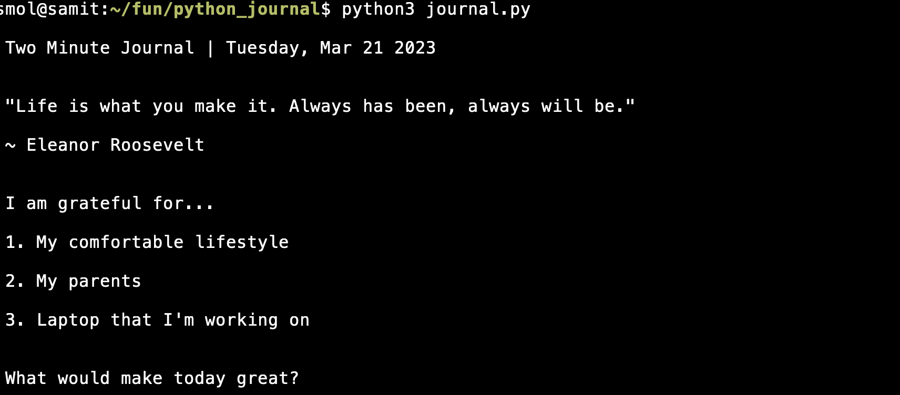

# The Python Two Minute Journal



---

## Requirements

* Python >= 3.7
* pip
* requests
* python-dotenv==0.21.0
* Jinja2==3.1.2

### Installation

```
pip install -r requirements.txt
```

### Start your daily Two Minute Journal

Run it twice a day, morning and evening.

```
python3 journal.py
```

Journal markdown files will be saved in the `journals` directory.

```
2023/5MJ-2023-06-28.md
2022/5MJ-2022-01-12.md
```

The Markdown file.

```markdown

Two Minute Journal | Friday, Jan 27 2023

> If someone betrays you once, it's their fault; if they betray you twice, it's your fault.
>
> ~ Eleanor Roosevelt

---
05:48 PM

### I am grateful for...

1. Dad for giving me money always when I need it
2. Being consistent with my college studies so I don't have last minute stress when it comes to finals
3. The independent and single room life I'm living

### What would make today great?

1. Confident when revising Web Programming for finals tomorrow
2. Leetcode daily problem
3. Good dinner

### Daily affirmations

1. I got 10 CGPA in my 3rd year
2. I am working towards computer science like George Hotz
3. I am confident about myself

---
06:46 PM

### Highlights of the day

1. Burger King
2. Singularity paper
3. Talking to my family

### What did I learn today?

1. Web Programming
2. Time dilates as you delay work
3. Hunger goes well with studying

```

## License

[MIT](https://choosealicense.com/licenses/mit/)