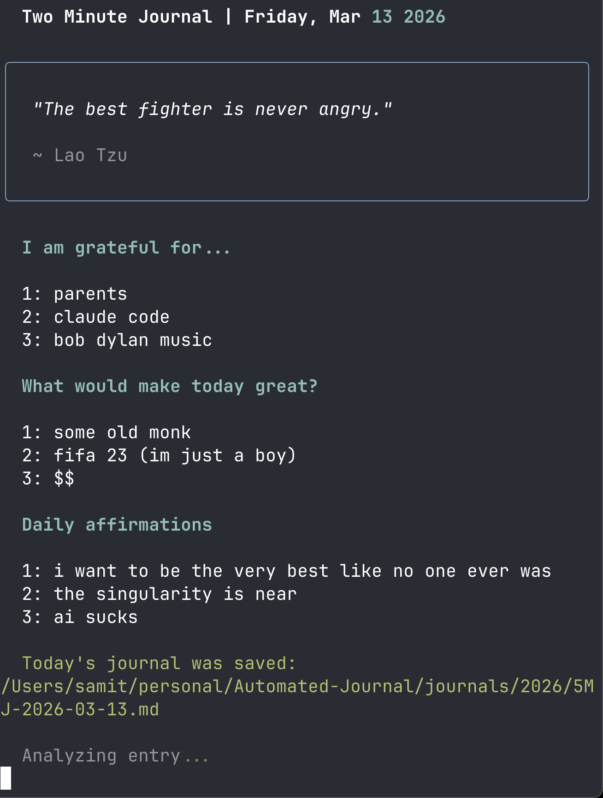
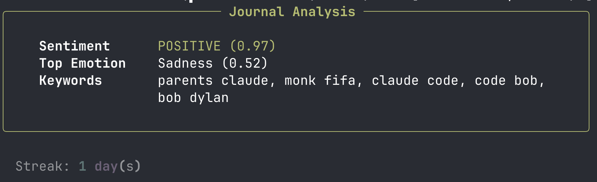
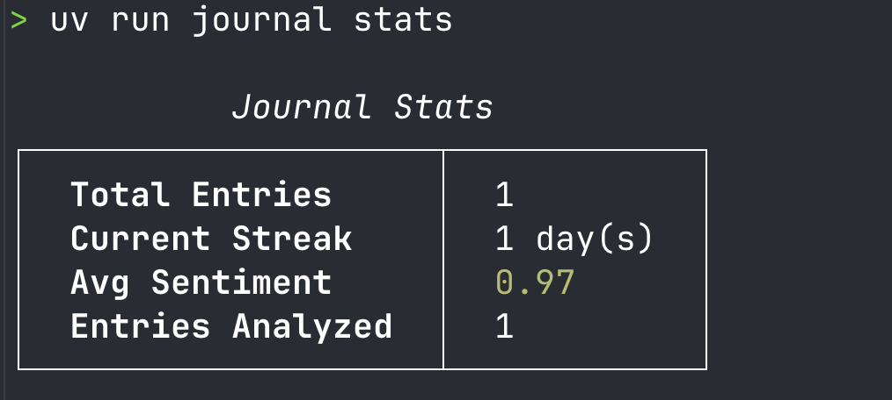
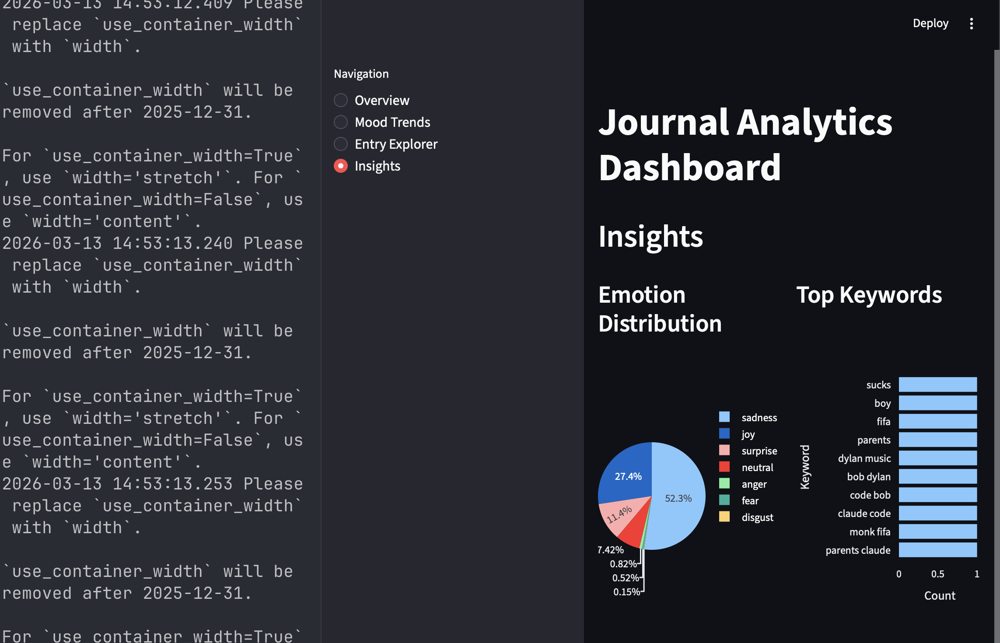

# Journal App - AI-Powered Journaling CLI

An intelligent journaling CLI that combines the simplicity of a two-minute daily journal with NLP-powered mood analysis. Write morning and evening entries, get real-time sentiment and emotion analysis, track your streaks, and explore mood trends through an interactive dashboard.

---

## Features

- **Rich Terminal UI** - color-coded prompts, panels, and tables powered by Rich
- **NLP Sentiment Analysis** - automatic positive/negative classification using DistilBERT
- **7-Emotion Detection** - anger, disgust, fear, joy, neutral, sadness, surprise via DistilRoBERTa
- **Keyword Extraction** - statistical keyword extraction using YAKE
- **Streak Tracking** - consecutive day tracking to build journaling habits
- **Streamlit Dashboard** - interactive charts for mood trends, emotion distribution, and insights
- **Morning/Evening Entries** - run twice daily for a complete reflection cycle

## Screenshots

### Interactive Journaling Session
<!-- Rich-formatted CLI with quote panel and prompts -->


### Post-Entry Analysis
<!-- Sentiment, emotion, and keyword analysis panel shown after saving -->


### Journal Stats
<!-- Stats table showing entries, streak, and average sentiment -->


### Dashboard - Insights
<!-- Emotion pie chart, top keywords, day-of-week patterns -->


---

## Tech Stack

| Component | Tool | Why |
|-----------|------|-----|
| Sentiment | `distilbert-base-uncased-finetuned-sst-2-english` | Fast, standard baseline (~268MB) |
| Emotion | `j-hartmann/emotion-english-distilroberta-base` | 7 emotions, richer than binary sentiment (~330MB) |
| Keywords | `yake` (statistical) | No model download, pragmatic for short personal text |
| CLI | `rich` | Modern terminal formatting |
| Dashboard | `streamlit` + `plotly` | Interactive charts with minimal code |
| Storage | Markdown + JSON sidecars | Git-trackable, no database needed |

## Requirements

- Python >= 3.10
- [uv](https://docs.astral.sh/uv/) (package manager)

## Installation

```bash
# Clone the repository
git clone https://github.com/yourusername/Automated-Journal.git
cd Automated-Journal

# Install dependencies
uv sync

# (Optional) Install dev dependencies for testing/linting
uv pip install ruff pytest pytest-cov
```

## Usage

### Daily Journaling

Run it twice a day - morning and evening:

```bash
uv run journal
```

The CLI will:
1. Display a daily inspirational quote
2. Prompt you through 3 morning questions (gratitude, goals, affirmations)
3. Save the entry as markdown
4. Run NLP analysis and display a summary

Run again in the evening for 2 reflection questions (highlights, lessons learned).

### Batch Analyze Past Entries

```bash
uv run journal analyze          # analyze entries without existing analysis
uv run journal analyze --force  # re-analyze all entries
```

### View Stats

```bash
uv run journal stats
```

### Launch Dashboard

```bash
uv run journal dashboard
```

## Project Structure

```
src/journal_app/
  cli.py                    # Rich-powered CLI entry point
  config.py                 # Environment and i18n configuration
  models.py                 # Journal, Question, Answer models
  providers/
    base.py                 # ABC base classes for storage and quotes
    zen_quote_provider.py   # Daily quote fetcher
    markdown_storage_provider.py  # Markdown + JSON sidecar storage
  analysis/
    schemas.py              # SentimentResult, EmotionScores, JournalAnalysis
    parser.py               # Markdown journal parser
    analyzer.py             # HuggingFace pipeline: sentiment + emotion + keywords
  dashboard/
    app.py                  # Streamlit dashboard with 4 pages
templates/                  # Jinja2 templates for markdown output
tests/                      # pytest test suite (36 tests)
```

## Output Format

Journal entries are saved as markdown with JSON analysis sidecars:

```
journals/
  2023/
    5MJ-2023-06-28.md               # journal entry
    5MJ-2023-06-28.analysis.json    # NLP analysis results
```

## Development

```bash
# Run linter
uv run ruff check .

# Run tests with coverage
uv run pytest --cov=journal_app --cov-report=term-missing -v

# All 36 tests pass with mocked HuggingFace models (no model downloads needed)
```

## Configuration

Copy `.env.example` to `.env` and customize:

```bash
LOCALE=en
TITLE="Two Minute Journal"
NAMESPACE="5MJ"
DEFAULT_TOTAL_ANSWERS=3
OUTPUT_DIR="journals"
```

## License

[MIT](https://choosealicense.com/licenses/mit/)
